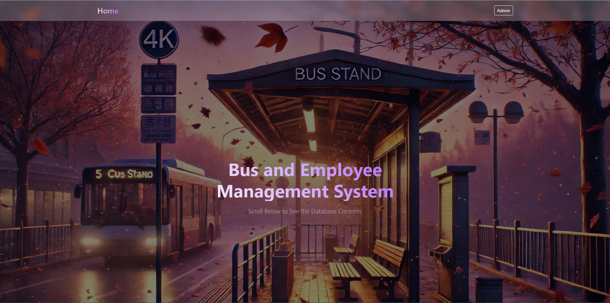
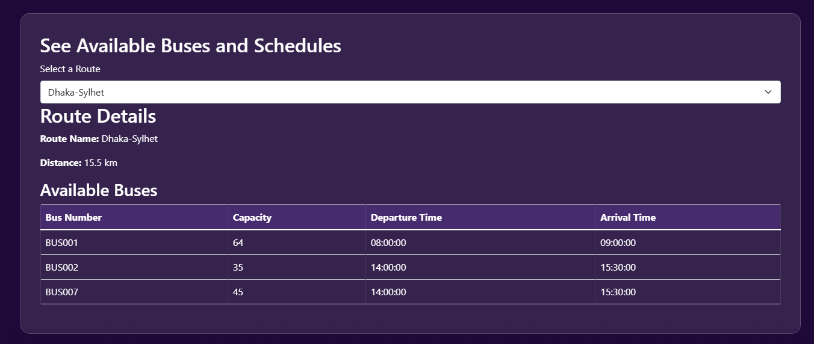
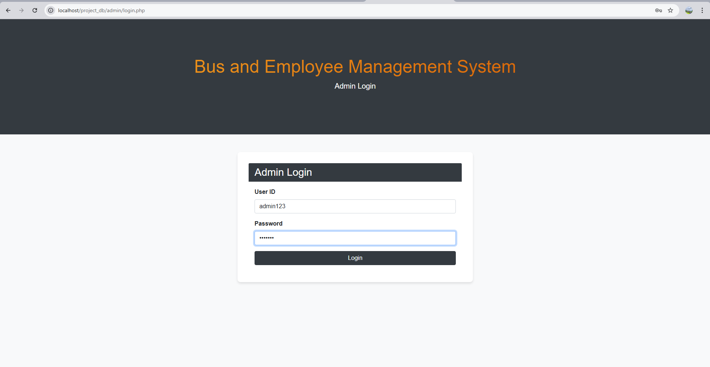
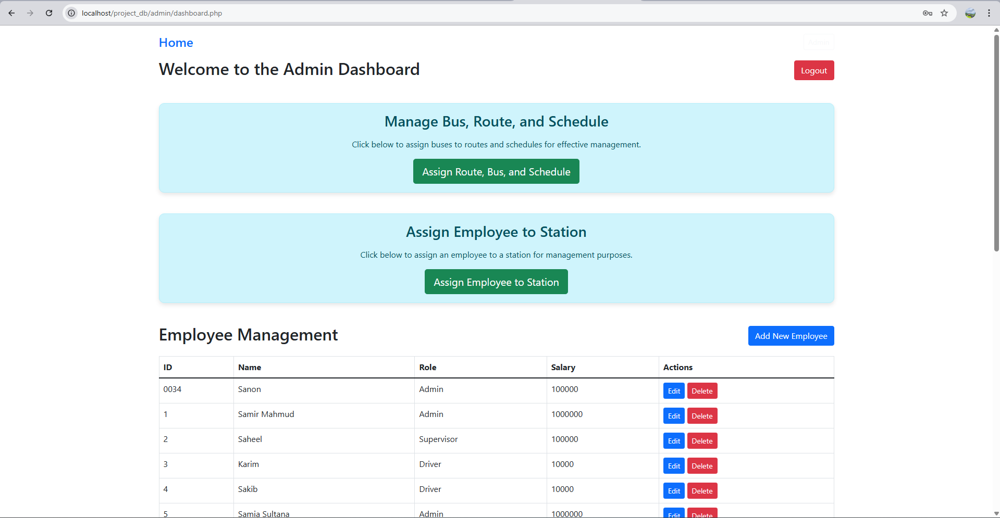

# Bus, Route & Employee Management System

A PHP + MySQL (XAMPP) web application built for **CSE311 – Database Management System**.  
It provides an admin panel for managing buses, routes, employees, and assignments using a relational database.

---

## Features

### Public / Home Page
- View buses, employees, stations, and other database contents
- Select a route to view available buses and schedules

### Admin Panel
- Admin login/logout
- CRUD operations:
  - **Bus**: add / edit / delete
  - **Route**: add / edit / delete
  - **Employee**: add / edit / delete
- Assignments:
  - Assign **bus + schedule** to a **route**
  - Assign **employee** to a **station**

---

## Tech Stack

- **Frontend:** HTML, CSS, JavaScript, Bootstrap
- **Backend:** PHP
- **Database:** MySQL
- **Local server:** XAMPP (Apache + MySQL)

---

## Screenshots

### Home Page – Banner


### Home Page – Route Information


### Admin Login Page


### Admin Panel Dashboard


---

## Project Structure

```text
project_db/
├─ admin/                 # Admin panel pages (CRUD + assignments)
├─ assets/                # CSS, JS, images
├─ includes/              # header, footer, DB config
├─ temp/                  # SQL file + development notes
└─ index.php              # Home page


